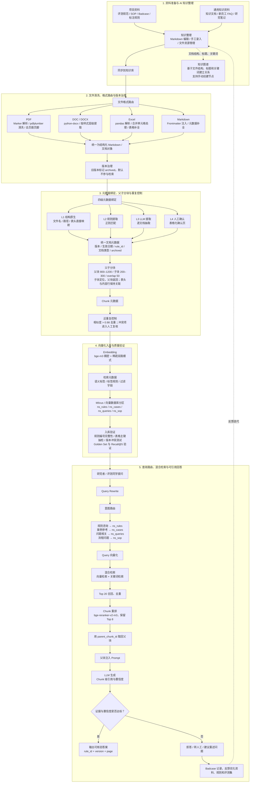

# CoreNote · Knowledge Hub

> 面向个人研究者、学生、AI 从业者、知识工作者和小团队的开源 AI 知识工作台（AI Knowledge Workspace）。
>
> 将 PDF、Markdown、网页和项目资料沉淀为可检索、可追问、可关联、可长期复用的个人 RAG 知识库（Personal RAG Knowledge Base）。

**[官方网站 / 在线体验：corenote.cloud](https://corenote.cloud/)** · [知识库使用指南](https://corenote.cloud/knowledge-base.html) · [部署目录](deploy/) · [贡献指南](CONTRIBUTING.md) · [安全说明](SECURITY.md)

---

## CoreNote 是什么？

CoreNote（本仓库项目名：Knowledge Hub）是一个可自托管的 AI 知识工作台。它帮助用户把分散的论文、课程资料、网页、PDF、Markdown、会议记录、项目文档和 Office 文件整理为可查询、可引用、可持续追问的知识库。

系统先对资料进行解析、清洗与分块，再结合向量检索和关键词检索找到相关证据；用户可以围绕检索结果提问、继续追问、整理 Markdown，或让受控 Agent 生成主题综述、写作草稿与定期回顾内容。

CoreNote 关注的不只是“上传文件后聊天”，而是让资料能够在研究、学习、项目协作和长期知识管理中持续复用。

### 你可能正在寻找的能力

| 常见需求 | CoreNote 的对应方式 |
| --- | --- |
| “有没有能导入 PDF、Markdown 的个人知识库？” | 支持网页、Markdown、PDF、Word、Excel、PPT、HTML 等资料入口。 |
| “能不能根据我的项目资料持续追问？” | 在检索到文件证据后进行 RAG 问答，并支持基于上下文的继续追问。 |
| “我不想把资料和 Key 交给第三方 SaaS。” | 项目可自托管；文档、向量索引和 API Key 由部署者自行管理。 |
| “能不能同时兼顾语义检索与关键词检索？” | 使用向量检索与 BM25 关键词检索组成混合检索，可选重排序。 |
| “想把散落资料变成长期可复用的研究资产。” | 支持文档、主题和项目资料的组织，以及 Markdown、文件资源和引用结果沉淀。 |

---

## 适合谁使用？

### 个人研究者与学生

将课程讲义、论文、实验材料、阅读笔记和 PDF 资料导入知识库，围绕研究问题查找证据、比较观点、持续追问，并将结论沉淀为可复用的 Markdown 笔记。

### AI 从业者与开发者

将技术文档、接口说明、模型评测、故障复盘和项目资料组织为内部 RAG 知识库。结合引用证据、检索质量评测和 Agent 工作流，降低“模型无依据回答”的风险。

### 知识工作者

把网页资料、报告、会议材料、产品方案和历史文档集中管理；在写作、方案梳理、项目复盘和信息检索时，优先从自己的资料中获取有出处的答案。

### 小团队

在自己可控的部署环境中使用统一知识入口，让团队资料、主题综述和工作流产物可以复用。项目不承诺替代成熟的企业级权限、审计或大规模协同系统，适合先从轻量的可控知识工作流开始。

---

## 核心能力

### 1. 多源资料导入与采集

- 浏览器插件采集网页正文、来源信息和图片；
- 导入 Markdown、PDF、Word、Excel、PPT、HTML 等文件；
- 支持将项目资料、手工笔记和自动采集内容纳入统一知识入口；
- 针对复杂资料进行解析、清洗、版面感知分块和基础质量检查。

### 2. 个人 RAG 知识库与混合检索

- 使用 Embedding 向量检索理解语义相近内容；
- 使用 BM25 关键词检索匹配术语、专有名词和精确表达；
- 将两种召回结果进行混合、去重，并可接入 Reranker；
- 支持 query rewrite 与 query expansion 等检索增强配置；
- 可使用本地向量后端，也可连接 Milvus 或 Zilliz。

### 3. 基于证据的问答与持续追问

- 根据知识库中的相关 chunk 和文件内容回答问题；
- 回答可关联文件路径与证据上下文，方便回到原始资料核验；
- 证据不足时应明确降级，而不是把猜测伪装成结论；
- 支持结合对话摘要保留长对话中的必要上下文，便于围绕同一主题继续追问。

### 4. 知识组织与可复用产出

- 将文档、主题、项目和文件资源沉淀为可回看的知识资产；
- 使用 Markdown 保存研究结论、方案草稿和工作记录；
- 通过主题综述、周报或邮件提醒等工作流，将输入资料转化为可消费的输出；
- 支持文档和主题关联视图，帮助从“文件堆”走向可理解的知识结构。

### 5. 受控 Agent 工作流

Agent 围绕检索、去重、归纳、写作和引用校验等步骤组织工作。它适合生成基于资料的初稿、主题归纳和待人工确认的结果，而不是替代事实核验、授权判断或外部发布审批。

---

## 从资料到可引用答案：知识治理与 RAG 工作流

下面的流程图对应 CoreNote 的资料治理、索引、检索和回答链路。它不是“上传文件后直接让模型回答”的黑盒：每份资料需要经过版本治理、元数据绑定、父子分块、可验证入库和按意图检索，最终才由模型根据证据生成可核验的结果。



### 关键设计点

| 环节 | CoreNote 的设计目标 | 关键做法 |
| --- | --- | --- |
| 资料与版本 | 保留来源与历史版本，避免“旧规则覆盖新规则” | 旧资料标记 `archived`；检索时可按版本、生效日期、资料类型过滤。 |
| 元数据 | 让“规则、案例、问题、SOP”可区分、可追溯 | 结构原生映射、规则抽取、LLM 抽取和人工确认四级结合。 |
| 分块 | 既能精确命中，又不丢失上下文 | 子 chunk 用于定位，父 chunk 用于回答；表格表头与内容行保持关联。 |
| 检索 | 降低只靠语义或只靠关键词的遗漏 | 向量召回与关键词召回混合，去重后再重排。 |
| 回答 | 不把无依据生成包装成结论 | 带 `rule_id`、版本、页码或来源引用；证据不足时拒答或转人工。 |
| 质量闭环 | 用真实问题持续改进，而非只看“能不能回答” | Golden Set、Recall@5、版本冲突测试和 Badcase 回流。 |

> 上图展示的是可落地的知识治理与 RAG 架构。不同部署可以按实际模型、文档格式、向量后端和业务字段裁剪；涉及评测、合规、医疗、法律、财务或其他高风险结论时，仍须由人工核验原始资料。

---

## 使用场景示例

| 场景 | 你可以怎么用 |
| --- | --- |
| 论文与文献研究 | 导入论文 PDF、文献笔记和数据说明，询问某一观点的依据、差异和相关原文。 |
| 考试与课程学习 | 将讲义、教材节选和复习笔记整理到知识库，按章节或知识点持续追问。 |
| 产品与项目管理 | 整合 PRD、会议纪要、技术方案和历史复盘，快速定位“为什么这样决定”。 |
| 开发者技术知识库 | 导入 API 文档、架构说明、故障日志与代码说明，减少反复搜索和上下文切换。 |
| 内容写作与报告 | 从已有研究资料中提炼主题框架、引用依据和初稿，而不是从空白页面开始。 |
| 个人信息管理 | 保存网页剪藏、Markdown 笔记和长期项目资料，在需要时按语义或关键词检索。 |

---

## 常见问题（FAQ）

### CoreNote 是不是一个个人知识库？

是。CoreNote 的目标是帮助个人或小团队建立可控的 AI 知识工作台：资料可以被导入、索引、检索、引用和持续复用，而不仅是保存为孤立文件。

### CoreNote 支持 PDF 和 Markdown 吗？

支持。项目可处理 Markdown、PDF 以及 Word、Excel、PPT、HTML 等多种常见资料格式。不同文档的解析质量会受到原文件结构、扫描质量、OCR、表格布局和图片内容影响，复杂文件建议人工抽检。

### 可以就同一批资料持续追问吗？

可以。系统会基于已建立的知识库检索相关内容，并支持结合对话上下文继续追问。对于需要精确结论的场景，仍应打开引用来源核验原文。

### CoreNote 和普通网盘、笔记软件有什么区别？

网盘和笔记软件擅长保存、编辑和分类文件；CoreNote 重点在于将资料转换为可检索的上下文，并用混合检索、引用证据和 Agent 工作流辅助“从资料中找答案、形成草稿、沉淀结论”。它可以与已有笔记体系并存，而不是要求替换所有工具。

### CoreNote 是否完全离线？

部署方式和模型配置由使用者决定。项目可以自托管数据与服务，也可以连接兼容 API 的远程 LLM、Embedding 服务或外部向量数据库。请根据隐私要求、成本和性能选择合适的组合。

### 会不会出现模型编造内容？

任何生成式模型都可能出错。CoreNote 通过检索、引用上下文和证据不足时的降级机制降低风险，但不能保证所有输出都正确。研究结论、外部发布、医疗、法律、财务或其他高风险决策必须由人复核。

### 适合直接作为大型企业知识库平台吗？

当前项目更适合个人和小团队的自托管知识工作流。高并发、复杂多租户权限、企业级审计、超大规模数据治理等需求需要额外工程设计与验证。

---

## 技术组成

| 层级 | 组件 / 方式 | 作用 |
| --- | --- | --- |
| Web 与 API | FastAPI、Uvicorn | 提供后端服务与 API 能力。 |
| 文档处理 | 多格式解析、清洗、分块、布局与表格相关配置 | 将原始资料处理为可检索内容。 |
| 语义检索 | Embedding + 本地向量后端或 Milvus / Zilliz | 按语义相似度发现相关文本片段。 |
| 关键词检索 | BM25 | 提升精确术语、名称和关键词命中。 |
| 检索增强 | 混合召回、去重、重排序、Query Rewrite / Expansion | 改善召回覆盖与答案上下文。 |
| 生成能力 | 兼容 OpenAI API 的 LLM | 在检索证据基础上生成问答和工作流草稿。 |
| 部署 | Docker / Docker Compose | 便于本地和服务器环境运行。 |

---

## 快速开始

### 前置条件

- Docker 20.10+ 与 Docker Compose v2+；
- 推荐 4 GB 及以上内存；
- 低内存服务器应使用精简依赖、单 Uvicorn worker、外部模型与外部向量服务，并避免在生产机频繁重建镜像；
- 一个兼容 OpenAI API 的 LLM，以及一个 Embedding 服务或本地 Embedding 配置。

```bash
git clone https://github.com/zhangjianxin477/knowledge-hub.git
cd knowledge-hub
cp .env.example .env
```

在 `.env` 中填写自己的模型配置。以下仅为变量示例，请根据实际服务商调整：

```env
OPENAI_API_KEY=your_llm_api_key
OPENAI_BASE_URL=https://your-llm-endpoint/v1
OPENAI_MODEL=your_model_name

EMBEDDING_API_KEY=your_embedding_api_key
EMBEDDING_BASE_URL=https://your-embedding-endpoint/v1
EMBEDDING_MODEL=your_embedding_model
EMBEDDING_DIMENSION=1024
EMBEDDING_LOCAL_ENABLED=false
```

启动本地服务：

```bash
docker compose -f docker-compose.local.yml up -d --build
curl http://localhost:8080/api/v1/health
```

随后打开 `http://localhost:8080`。生产部署请查看 [`deploy/`](deploy/) 目录，并配置独立域名、HTTPS、随机 `SECRET_KEY`、持久化数据卷和严格的 `CORS_ORIGINS`。

> 不要将真实 Key 写进前端 JavaScript、提交到 Git、粘贴到公开 Issue，或发送到不可信聊天记录中。

---

## 浏览器插件

1. 打开 `chrome://extensions`，开启开发者模式；
2. 选择“加载已解压的扩展程序”，并选择 `browser-extension/`；
3. 在插件设置中填写你的实例地址，例如 `https://corenote.cloud`；
4. 登录同一实例后采集网页，内容将进入知识库工作流。

浏览器采集适合将公开网页、阅读资料和研究来源快速沉淀到个人知识库中。对于登录页、动态网页、防盗链图片和受版权/访问限制的内容，请遵守网站规则与适用法律。

---

## 向量服务：Milvus / Zilliz

如需使用 Milvus 或 Zilliz，可在 `.env` 中配置：

```env
VECTOR_BACKEND=milvus
MILVUS_URI=https://your-cluster.serverless.cloud.zilliz.com
MILVUS_TOKEN=your_milvus_token
MILVUS_COLLECTION=knowledge_hub_chunks
MILVUS_METRIC_TYPE=COSINE
```

Embedding 维度必须与 Collection Schema 一致。更换 Embedding 模型或维度时，请创建新 Collection 或全量重建向量，避免混用旧索引。

---

## 评测、质量与安全

### 检索质量

检索效果与资料质量、文档分块、Embedding 模型、关键词配置、Reranker、查询表达和评测集密切相关。建议准备一组真实问题及其期望来源，针对 Recall、引用准确性、响应时间和坏例进行持续回归测试。

仓库中包含与检索、在线 Agent、新闻分块和数据迁移相关的脚本；新增检索能力时，建议同时补充可复现的评测 query 与 badcase。

### 安全与数据控制

- `.gitignore` 用于排除 `.env`、数据、日志、虚拟环境、证书和备份；
- 密钥应通过服务器环境变量、GitHub Secrets 或 Secret Manager 注入；
- 若 Key 曾出现在 Git、聊天、截图、日志或构建产物中，请立即撤销并重新生成；
- 详见 [SECURITY.md](SECURITY.md)。

---

## 项目结构

```text
backend/             FastAPI 后端、文档处理、检索与 Agent 相关逻辑
frontend/            Web 前端资源
browser-extension/   浏览器采集插件
deploy/              Nginx、VPS、Oracle、租户等部署示例
scripts/             评测、迁移和运维辅助脚本
tools/               开发辅助工具
```

---

## 当前边界

CoreNote 是面向个人和小团队的开源知识工作台，不承诺大规模高并发。复杂 PDF、扫描件 OCR、动态网页、防盗链图片和表格解析结果需要人工检查；Agent 默认输出草稿，外部发布、发送、写入第三方系统或高风险判断应经过授权与人工确认。

如果你希望参与改进，欢迎提交 bug 修复、文档优化、评测用例或可复现的检索 badcase，具体请阅读 [CONTRIBUTING.md](CONTRIBUTING.md)。

## 官方入口与公开内容

- 官网：[CoreNote](https://corenote.cloud/)
- 产品与知识指南：[如何将 PDF、Markdown 与项目资料沉淀为可检索、可追问、可核验的个人知识库](https://corenote.cloud/knowledge-base.html)
- 微信公众号：[CoreNote 公众号文章](https://mp.weixin.qq.com/s/YGWGNBr6DwAv1dNuvmqDxA)
- 知乎：[有没有能把 PDF、Markdown 和项目资料沉淀为个人知识库的 AI 工具？我搭了一套可持续追问的知识工作台](https://zhuanlan.zhihu.com/p/2087574739527143588)
- 掘金：[不是上传 PDF 聊天：个人 RAG 知识库如何实现版本治理、父子分块、混合检索与可引用回答](https://juejin.cn/spost/7689415591787462682)
- CSDN：[个人 RAG 知识库部署踩坑：PDF、Markdown 与项目资料如何做成可检索、可追问的知识工作台](https://blog.csdn.net/m0_72717175/article/details/166738130)
  
这些内容分别从产品选择、RAG 架构与部署实践的角度说明 CoreNote。它们用于帮助读者理解项目边界和使用方式，不代表任何搜索引擎或 AI 产品一定会引用本项目。

## License

[MIT License](LICENSE)。
